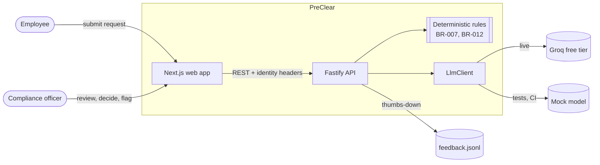
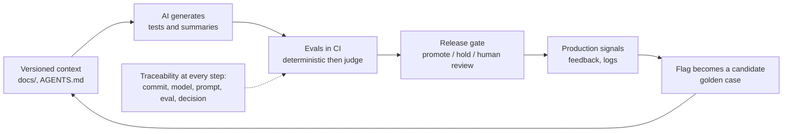

# Architecture (C4) and the AI quality loop

Rendered by GitHub. A plain flowchart is used because Mermaid's C4 syntax is still experimental.

## System context and containers

## The closed quality loop (pillars 1 to 5)

